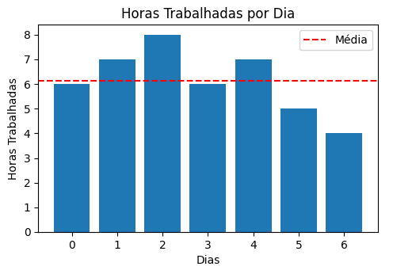
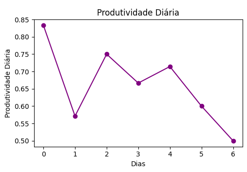

# **Módulo 4 – Relatório Diário**

## Descrição

Este projeto consiste em um sistema para gerar relatórios diários com base em uma planilha de acompanhamento. O sistema importa um arquivo Excel, realiza algumas análises e gera visualizações úteis.

## Conteúdo

- [Proposta](#proposta)
- [Estrutura do Projeto](#estrutura-do-projeto)
- [Requisitos](#requisitos)
- [Dependências](#dependências)
- [Como Usar](#como-usar)
- [Visualizações](#visualizações)
- [Contribuições](#contribuições)
- [Autor](#autor)
- [Licença](#licença)

## Proposta

Este é um programa com o propósito de gerar um relatório de progresso diário para mostrar o quão produtivo está sendo o trabalho dos funcionários e incluir no relatório outros itens como: 

- Total de Horas Trabalhadas
- Média Diária de Horas Trabalhadas
- Total de Bugs Corrigidos
- Média Diária de Bugs Corrigidos
- Total de Tarefas Concluídas
- Média Diária de Tarefas Concluídas
- Produtividade Diária

## Estrutura do Projeto

- [**data/**](./data)
  - [relatorio_diario.xlsx](./data/relatorio_diario.xlsx)
- [**notebooks/**](./notebooks)
  - [relatorio_diario.ipynb](./notebooks/relatorio_diario.ipynb)
- [**LICENSE.md**](./LICENSE.md)
- [**README.md**](./README.md)
- [**requirements.txt**](./requirements.txt)

## Requisitos

Para executar este notebook, certifique-se de ter os seguintes requisitos instalados:

[Python](https://docs.python.org/3/) 3.x: Download Python

[Pandas](https://pandas.pydata.org/pandas-docs/stable/): Instale com `!pip install pandas`

[NumPy](https://numpy.org/doc/stable/): Instale com `!pip install numpy`

[Matplotlib](https://matplotlib.org/stable/contents.html): Instale com `!pip install matplotlib`

### Dependências

- Python 3.8
- Pandas 1.3.3
- NumPy 1.21.2
- Matplotlib 3.4.3

## Como Usar

- Clone este repositório ou faça o download dos arquivos.
- Abra o Jupyter Notebook no seu ambiente local ou utilize o Google Colab.
- Execute o notebook `relatorio_diario.ipynb` e siga as instruções.

### Aplicabilidade

Uma forma de utiliza-lo é substituir as informações que quer visualizar, nas variáveis pré-definidas e renomea-las de acordo;
Identifique as colunas do seu arquivo e substitua os nomes das colunas a serem identificadas no código, assim, poderá reutilizar todo o projeto!

## Visualizações

### Horas Trabalhadas

### Produtividade Diária

## Contribuições

Sinta-se à vontade para contribuir para este projeto! Caso queira propor melhorias, correções ou novas funcionalidades, siga as diretrizes abaixo:

1. Faça um fork do repositório.
2. Crie uma branch para a sua feature (`git checkout -b feature/NovaFeature`).
3. Faça commit das suas alterações (`git commit -m 'Adiciona nova feature'`).
4. Faça push para a branch (`git push origin feature/NovaFeature`).
5. Abra um pull request.

### Suporte

Caso encontre problemas ou tenha dúvidas, sinta-se à vontade para abrir uma issue no GitHub ou entre em contato pelo email beatrizmmiranda@outlook.com.

## Autor

- Beatriz Miranda
- beatrizmmiranda@outlook.com
- https://github.com/lastfirefly
- https://instagram.com/lastfirefly

## Licença
Este projeto está licenciado sob a Licença Apache - veja o arquivo LICENSE.md para detalhes.

## Agradecimentos
Gostaria de agradecer ao SENAC e a Resília pela oportunidade que me foi dada de aprender e adquirir experiência com o bootcamp fornecido em Formação em Análise de Dados, gostaria também de agradecer à facilitadora Fátima e ao mediador Douglas que me auxiliou a todo momento com minhas dificuldades, quero também agradecer aos meus colegas de curso por toda a motivação e inclusão por parte deles que me ajudou a progredir no curso. Por último mas não menos importante, quero agradecer ao Natan Gonzaga por todo apoio que me dá em todos os meu projetos, tanto pessoais quanto acadêmicos e que, sem esse apoio, esse projeto não teria sido desenvolvido. Para finalizar, quero agradecer a você que está lendo este projeto por acreditar que seja uma forma de facilitar seu dia-a-dia ou enriquecer seus conhecimentos! (≧▽≦)